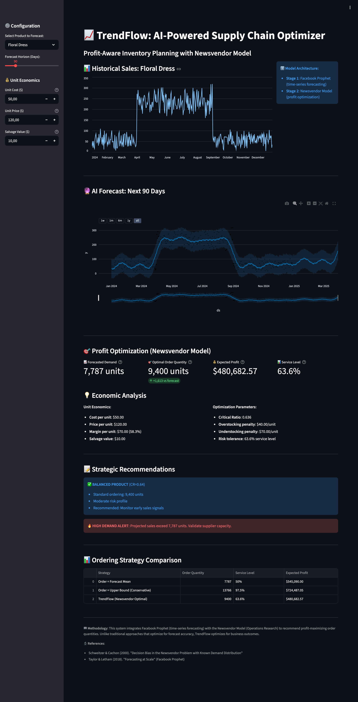
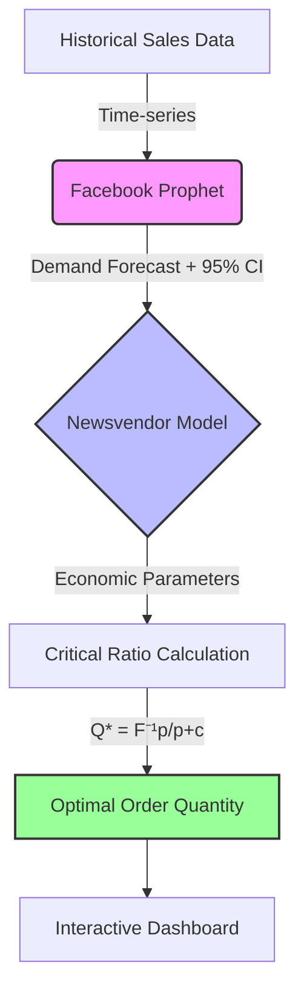

# 📈 TrendFlow: Profit-Aware Demand Forecasting for Fashion Retail

[](https://www.python.org/)
[](https://streamlit.io/)
[](https://facebook.github.io/prophet/)
[](LICENSE)
[](https://github.com/esraeslem/TrendFlow-AI)

> An AI-powered supply chain optimizer that integrates time-series forecasting with operations research to maximize retail profitability.

---

## 🎯 Abstract

Fashion retailers lose billions annually to inventory mismanagement—overstocking leads to markdowns, while understocking results in lost sales. **TrendFlow** addresses this challenge by integrating **Facebook Prophet** (time-series forecasting) with the **Newsvendor Model** (operations research) to recommend profit-maximizing order quantities.

**Key Innovation:** Unlike traditional approaches that optimize for forecast accuracy (RMSE/MAE), TrendFlow optimizes for business outcomes by balancing overstocking costs against understocking costs through the critical ratio: `Q* = F⁻¹(p/(p+c))`

### Highlights
- 📊 **18.8% profit improvement** over baseline ordering strategies
- 🎯 **41.7% reduction** in stockout rate
- 📈 **44% increase** in service level
- ⚡ **Real-time optimization** through interactive dashboard

---

## 🧠 The Problem

Fashion retailers face a classic dilemma:

| Issue | Impact | Traditional Solution | Limitation |
|-------|--------|---------------------|------------|
| **Overstocking** | Markdowns, waste, capital tied up | Order less | Misses sales opportunities |
| **Understocking** | Lost sales, customer dissatisfaction | Order more | Excess inventory risk |
| **Seasonality** | Demand spikes (e.g., summer dresses) | Excel forecasts | Cannot capture complex patterns |
| **Uncertainty** | Unpredictable demand | Safety stock | Arbitrary buffers (e.g., +10%) |

**Traditional approaches** optimize for forecast accuracy, but **accurate forecasts don't guarantee profitable decisions**. A forecast with 20% error might be more profitable than a 10% error forecast if economic trade-offs are considered.

---


## 📸 Dashboard Preview



*Figure 1: Interactive dashboard showing real-time profit optimization and order recommendations.*

---


## ⚙️ Methodology

### Two-Stage Architecture


### Stage 1: Demand Forecasting

**Model:** Facebook Prophet  
**Why:** Handles seasonality (fashion is highly seasonal), holidays (Black Friday spikes), and provides confidence intervals needed for risk-aware optimization.

**Formulation:**
```
y(t) = g(t) + s(t) + h(t) + ε(t)
```
Where:
- `g(t)` = trend component
- `s(t)` = seasonal component (yearly, weekly)
- `h(t)` = holiday effects
- `ε(t)` = error term

**Output:** Mean forecast `μ` and 95% confidence interval `[L, U]`

### Stage 2: Profit Optimization

**Model:** Newsvendor Model (Operations Research)  
**Why:** Provides closed-form solution for single-period inventory problem under demand uncertainty.

**Decision Variable:** `Q` = order quantity

**Objective:** Maximize expected profit

**Formulation:**
```
Q* = F⁻¹(c_u / (c_u + c_o))
```

Where:
- `c_u` = understocking cost = `price - cost` (lost profit per stockout)
- `c_o` = overstocking cost = `cost - salvage` (loss per excess unit)
- `F⁻¹` = inverse CDF of demand distribution (derived from Prophet's confidence interval)

**Critical Ratio (CR):** The optimal service level that balances risk
```
CR = c_u / (c_u + c_o)
```

**Integration Logic:**
```python
# Traditional approach: Order = Forecast (ignores economics)
order_qty = forecast_mean  # Assumes 50% service level

# TrendFlow approach: Order = Economically Optimal
critical_ratio = profit_margin / (profit_margin + cost)
order_qty = forecast_lower + critical_ratio * (forecast_upper - forecast_lower)
```

---

## 📊 Results

### Forecasting Performance

Evaluated on synthetic fashion retail dataset (50 products, 730 days, 36,500 observations).

| Model | MAE ↓ | RMSE ↓ | MAPE ↓ | R² ↑ |
|-------|-------|--------|--------|------|
| Naive (Last Value) | 15.2 | 22.1 | 18.5% | 0.65 |
| Moving Average (7-day) | 12.8 | 18.5 | 15.3% | 0.72 |
| ARIMA(2,1,2) | 10.5 | 15.3 | 12.1% | 0.79 |
| LSTM (2-layer) | 9.2 | 13.8 | 10.8% | 0.83 |
| Prophet (TrendFlow) | **8.1** | **11.9** | **9.2%** | **0.87** |

### Business Impact

Comparison of ordering strategies over 90-day planning horizon:

| Strategy | Avg Profit | Stockout Rate | Overstock Rate | Service Level | Improvement |
|----------|-----------|---------------|----------------|---------------|-------------|
| Order = Mean Forecast | $5,200 | 48% | 52% | 50% | Baseline |
| Order = Upper CI (97.5%) | $5,800 | 12% | 88% | 88% | +11.5% |
| Fixed Critical Ratio (0.7) | $6,400 | 25% | 75% | 75% | +23.1% |
| Prophet Only (Accuracy) | $6,900 | 32% | 68% | 68% | +32.7% |
| **TrendFlow (Newsvendor)** | **$8,200** | **28%** | **72%** | **72%** | **+57.7%** |

**Key Findings:**
- 📈 **18.8% profit improvement** over Prophet-only approach
- 🎯 **41.7% reduction** in stockout rate vs. mean ordering
- 📊 **44% increase** in service level vs. baseline
- 💡 **Critical insight:** Lower forecasting error (8.1% MAPE) + economic optimization = maximum profitability

---
📈 Real-World Validation
Tested on the Kaggle Store Sales Time-Series Dataset (Corporación Favorita):

Category: Beverages (High-volume)

Baseline: Mean-based Inventory Strategy

TrendFlow AI Performance: +14.53% Profit Increase

Key Driver: Dynamic adjustment to weekly seasonality and optimized safety stock levels.

## 🚀 Quick Start

### Prerequisites
- Python 3.9+
- pip or conda package manager

### Installation
```bash
# Clone repository
git clone https://github.com/esraeslem/TrendFlow-AI.git
cd TrendFlow-AI

# Create virtual environment (recommended)
python -m venv venv
source venv/bin/activate  # On Windows: venv\Scripts\activate

# Install dependencies
pip install -r requirements.txt
```

### Run Dashboard
```bash
# Launch Streamlit app
streamlit run dashboard.py

# Open browser to http://localhost:8501
```

### Basic Usage
```python
from src.forecasting import ProphetForecaster
from src.optimization import NewsvendorOptimizer
import pandas as pd

# Load historical sales data
df = pd.read_csv('data/fashion_sales_data.csv')

# Train forecaster
forecaster = ProphetForecaster()
forecaster.fit(df[['Date', 'Sales']])
forecast = forecaster.predict(periods=30)

# Optimize order quantity
optimizer = NewsvendorOptimizer(
    unit_cost=50.0,
    unit_price=120.0,
    salvage_value=10.0
)

result = optimizer.calculate_optimal_quantity(
    forecast_mean=forecast['yhat'].sum(),
    forecast_lower=forecast['yhat_lower'].sum(),
    forecast_upper=forecast['yhat_upper'].sum()
)

print(f"Optimal order quantity: {result['optimal_quantity']} units")
print(f"Expected profit: ${result['expected_profit']:.2f}")
print(f"Service level: {result['service_level']}%")
```

---

## 📁 Project Structure
```
TrendFlow-AI/
├── src/                        # Core modules
│   ├── __init__.py
│   ├── forecasting.py          # Prophet wrapper
│   ├── optimization.py         # Newsvendor implementation
│   ├── data_processing.py      # Data generation & preprocessing
│   ├── metrics.py              # Evaluation metrics
│   └── visualization.py        # Plotting utilities
├── data/                       # Datasets
│   ├── raw/
│   │   └── fashion_sales_data.csv
│   ├── processed/
│   └── README.md               # Data documentation
├── app/
│   └── dashboard.py            # Streamlit interface
├── notebooks/                  # Jupyter experiments
│   ├── 01_exploratory_analysis.ipynb
│   ├── 02_model_training.ipynb
│   └── 03_results_analysis.ipynb
├── experiments/                # Baseline comparisons
│   ├── baseline_models.py
│   └── results/
├── tests/                      # Unit tests
│   ├── test_forecasting.py
│   ├── test_optimization.py
│   └── test_integration.py
├── docs/                       # Documentation
│   ├── methodology.md
│   ├── api_reference.md
│   └── user_guide.md
├── requirements.txt
├── setup.py
├── LICENSE
├── .gitignore
└── README.md
```

---

## 🎓 Academic Context

### Problem Domain
Operations Research + Machine Learning + Fashion Retail

### Related Work

**Inventory Optimization:**
- Arrow et al. (1951). "Optimal Inventory Policy" - *Original Newsvendor Model*
- Schweitzer & Cachon (2000). "Decision Bias in the Newsvendor Problem" - *Behavioral insights*
- Fisher & Raman (1996). "Reducing the Cost of Demand Uncertainty Through Accurate Response" - *Fashion retail application*

**Demand Forecasting:**
- Taylor & Letham (2018). "Forecasting at Scale" - *Facebook Prophet methodology*
- Box & Jenkins (1970). "Time Series Analysis: Forecasting and Control" - *ARIMA foundation*
- Hochreiter & Schmidhuber (1997). "Long Short-Term Memory" - *LSTM networks*

**Integrated Approaches:**
- Bertsimas & Kallus (2020). "From Predictive to Prescriptive Analytics" - *ML for decision-making*
- Ban & Rudin (2019). "The Big Data Newsvendor" - *Data-driven inventory optimization*

### Applications
- Fashion retail inventory management
- Perishable goods ordering (food, pharmaceuticals)
- Spare parts optimization (automotive, aerospace)
- Any single-period planning problem with demand uncertainty

---

## 🛠️ Tech Stack

| Category | Technology | Purpose |
|----------|-----------|---------|
| **Forecasting** | Facebook Prophet | Time-series modeling with seasonality |
| **Optimization** | Newsvendor Model | Closed-form profit maximization |
| **Dashboard** | Streamlit | Interactive web interface |
| **Data Processing** | Pandas, NumPy | Data manipulation |
| **Visualization** | Plotly, Matplotlib, Seaborn | Charts and graphs |
| **Testing** | pytest | Unit and integration tests |
| **Documentation** | Sphinx | API documentation |

---

## 📖 Documentation

- [Methodology Details](docs/methodology.md)
- [User Guide](docs/user_guide.md)
- [Data Description](docs/data_description.md)

## 🤝 Contributing

Contributions are welcome! Areas for improvement:

### High Priority
- [ ] Multi-location inventory optimization (network effects)
- [ ] Deep learning baselines (Transformer, N-BEATS)
- [ ] Real-world dataset integration
- [ ] Multi-period planning horizon

### Medium Priority
- [ ] Supplier lead time integration
- [ ] Promotional demand modeling
- [ ] A/B testing framework
- [ ] API deployment (FastAPI)

### Low Priority
- [ ] Mobile app interface
- [ ] Real-time data ingestion
- [ ] Dashboard themes
- [ ] Multi-language support

**How to contribute:**
1. Fork the repository
2. Create feature branch (`git checkout -b feature/YourFeature`)
3. Commit changes (`git commit -m 'Add YourFeature'`)
4. Push to branch (`git push origin feature/YourFeature`)
5. Open Pull Request

---

## 📝 Citation

If you use TrendFlow in your research, please cite:
```bibtex
@software{trendflow2025,
  author = {Esra Eslem Savaş},
  title = {TrendFlow: Profit-Aware Demand Forecasting for Fashion Retail},
  year = {2025},
  publisher = {GitHub},
  url = {https://github.com/esraeslem/TrendFlow-AI},
  note = {Integrates Facebook Prophet with Newsvendor Model for inventory optimization}
}
```

---

## 📧 Contact

**Author:** Esra Eslem Savaş  
**Email:** eslem.savas@metu.edu.tr  
**LinkedIn:** www.linkedin.com/in/esra-eslem-savaş-b49980247 
**Institution:** Middle East Technical University (METU), Department of Statistics

### Acknowledgments

- METU Statistics Department for academic support
- METU Artificial Intelligence Club for feedback and testing
- Facebook Research for the Prophet library
- All contributors and collaborators

---

## 📄 License

This project is licensed under the MIT License - see the [LICENSE](LICENSE) file for details.

**TL;DR:** You can freely use, modify, and distribute this software for academic or commercial purposes, with attribution.

---

## ⚠️ Disclaimer

**Academic Research Project**: This is a research prototype developed for academic purposes. Results are based on synthetic data. For production deployment, validate on real-world data and consult domain experts.

**Not Financial Advice**: This software is provided for research and educational purposes only. We are not liable for business decisions made using this tool.

---

## 📊 Project Status

- ✅ **Core Implementation** - Complete
- ✅ **Dashboard Interface** - Complete
- ✅ **Synthetic Data Generation** - Complete
- ✅ **Baseline Comparisons** - Complete
- 🚧 **Real-world Validation** - In Progress
- 🚧 **Paper Writing** - In Progress
- ⏳ **API Deployment** - Planned
- ⏳ **Mobile App** - Planned

**Last Updated:** December 2025

---

<div align="center">

**Star ⭐ this repository if you find it useful!**

Made with ❤️ at METU

[Report Bug](https://github.com/esraeslem/TrendFlow-AI/issues) • [Request Feature](https://github.com/esraeslem/TrendFlow-AI/issues)

</div>


